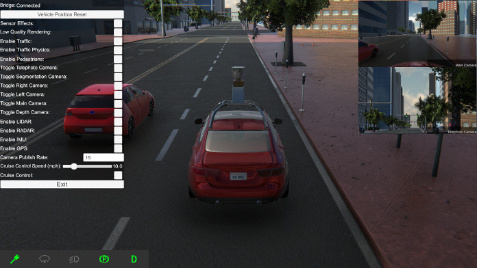

We have uploaded several example scripts that use our Python API to simulate basic scenarios to run through, along with [documentation](https://www.lgsvlsimulator.com/docs/api-example-descriptions/) describing how to run them. You can follow these example scripts to create your own simulation test cases. Two of the scenarios are based off of example specifications from [Open Scenario](http://www.openscenario.org/download.html). You can, for example, run a non-ego vehicle lane change scenario to see how your AD stack will behave in such situations. These use case examples highlight the ability to use our Python API to suit your use cases in an easy manner. Try it yourself!

Additionally, we have uploaded an example script allowing data collection from the simulator in the KITTI data format.

You can [view the documentation](https://www.lgsvlsimulator.com/docs/api-example-descriptions/) describing the example scripts.
