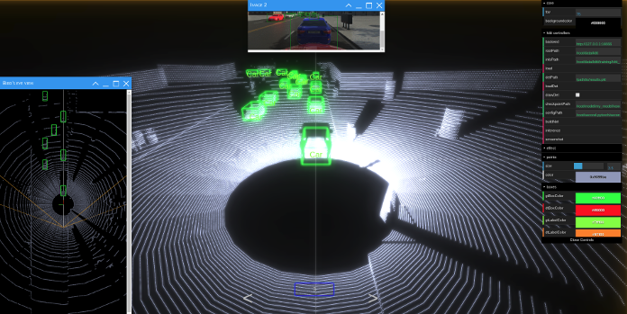

Lack of ground-truth datasets is often cited as the major development bottleneck for training a deep neural network in autonomous driving fields because it is a time-consuming and expensive task to collect and manually annotate a large amount of data from the real-world. This is even more problematic when the task requires labels that are difficult to specify manually such as putting a 3D bounding box for a car in LiDAR point clouds. Also, it is difficult to capture a large amount of data with sufficient variety in environmental settings as well.

A promising approach to overcome this limitation is to use LGSVL Simulator to automatically generate high-fidelity synthetic data. We present a system for automatically generating labeled data and training deep neural networks for 3D object detection from LiDAR point clouds. LGSVL Simulator publishes ground truth data including 2D and 3D bounding boxes for NPC vehicles and also offers a Python API so researchers and engineers can easily automate synthetic data collection as well as data annotation.

To handle the variability in real-world data, the system puts a random number of different types of vehicles at random positions and orientations in a 3D scene. The resulting LiDAR point clouds then get labeled automatically with 3D bounding boxes and are used for training the neural network. For future work, we can also try implementing even more Domain Randomization techniques to generate synthetic data by randomizing materials of cars or by randomizing point clouds rendering in the simulator. With enough variability in the simulator, the real world may appear to the model as just another variation.

Full source code, documentation, and a pre-trained model can be found here: [https://github.com/lgsvl/second-ros](https://github.com/lgsvl/second-ros)
