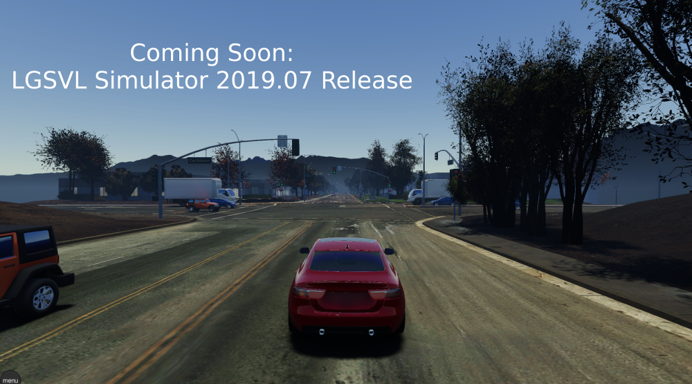
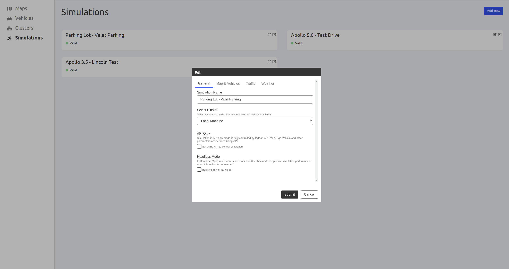

The upcoming LGSVL Simulator 2019.07 release will roll out in a couple of weeks, and there are some big changes for our users. While we have significantly improved things and added new features, please keep in mind that if you have many customizations to the simulator, they may not all be compatible at first with the new simulator.

You can [sign up](http://eepurl.com/gpuhkb) to our mailing list for the latest updates!

We are targeting a release date of July 29, 2019 for the 2019.07 version of the LGSVL Simulator. Here are some of the new features included in our upcoming release:

- A new web user interface for interacting with the simulator

- Use of Unity's High Definition Rendering Pipeline (HDRP)

- Separate asset bundles for maps and vehicles - ability to add and share custom environments and vehicles more easily

- Ability to dynamically add sensors to a vehicle without rebuilding the simulator

_A screenshot of the new web UI. A developer can configure simulations with the map, vehicle(s), environment, and other settings._
