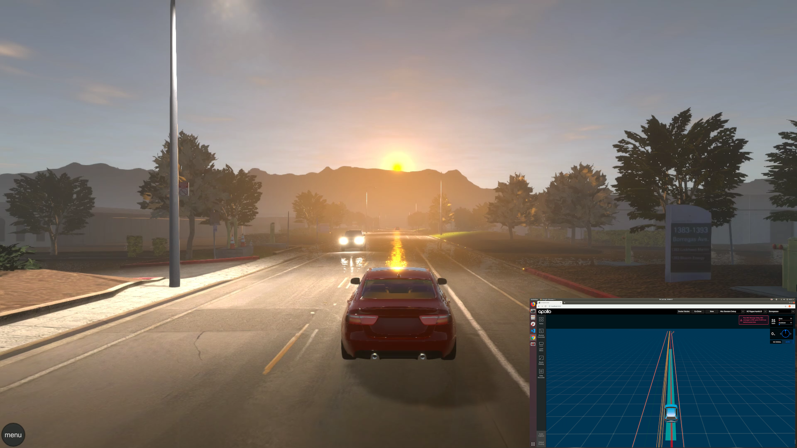
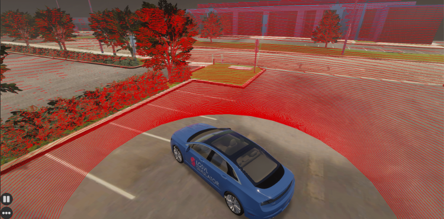
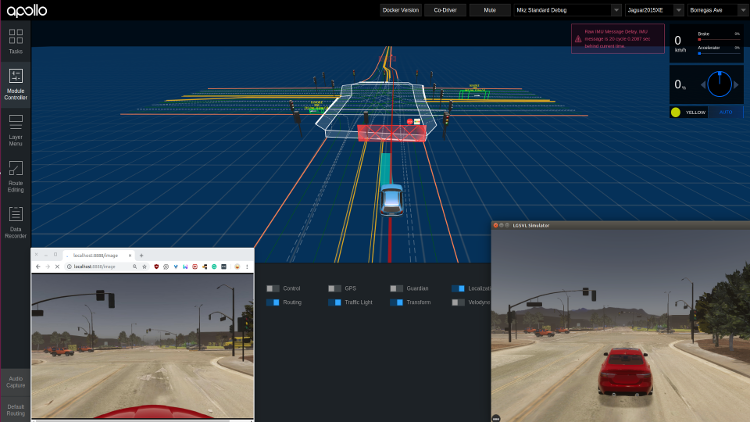
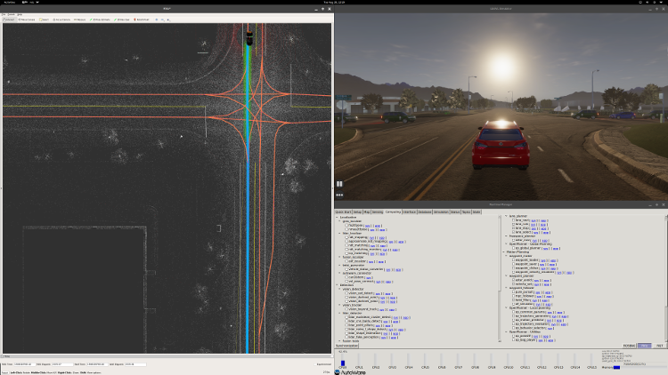

We are excited to announce that the [2019.07](https://github.com/lgsvl/simulator/releases/latest) release of SVL Simulator is now available for download on our GitHub. Below are some of the big features we want to highlight. You can see a full list in our [release notes](https://www.svlsimulator.com/docs/changelog/).

### Incorporating Unity's High Definition Render Pipeline

We have upgraded to Unity 2019.1.10, and have migrated to Unity's High Definition Render Pipeline (HDRP). You can [read more about HDRP](https://docs.unity3d.com/Packages/com.unity.render-pipelines.high-definition@6.9/manual/index.html). The result is increased photorealism of environments and agents. This means that sensor simulation, and in particular camera, is much more realistic.

### Migration to Web UI

We have changed the main user interface for interacting with the simulator to use a web browser. With a simpler and more organized interface, adding and choosing maps, vehicles, sensor configurations, and environment parameters are all done through a web user interface. This also means that the user interface can be accessed from a separate location from the actual computer that the simulator executable is running on, allowing for remote launch of simulation from a different machine.

### Dynamic loading of map and vehicle AssetBundles

We have now separated out 3D environments and vehicles from the main simulator executable, allowing users to bring in additional or custom AssetBundles into the simulator dynamically. If you have created custom components and scenes for SVL Simulator, you can use our export tools to create AssetBundles.

Now, when you want to bring in a new map or vehicle model, you can specify a URL or local file where the AssetBundle is located, and the simulator will automatically download it and make it available to use in simulations.

We have also rolled out the SVL Simulator Content site, a place users can go to obtain publicly available AssetBundles for use with SVL Simulator. You can find the site [here](https://content.svlsimulator.com).

### Lanelet2 HD map import and export

You can now import and export HD maps in Lanelet2 format. If you have a real-world HD map in Lanelet2 format, you can import this into a 3D environment in SVL Simulator, and it will be converted to our map annotations. This means that traffic agents in simulation will be able to follow traffic rules, such as traffic lights, stop signs, lanes, and turns. You can also export HD maps into Lanelet2 format, which can be used by autonomous driving stacks that support this format.

### Improved LiDAR performance

Our LiDAR sensor performance has been greatly improved. High-throughput sensors such as a 128-beam LiDAR successfully renders in realtime, and correct intensity values are published based on the reflectivity of the material of objects.

### Support for Apollo 5.0 and Autoware 1.12

Apollo running in SVL Simulator.

Autoware 1.12 running in SVL Simulator.

The SVL Simulator 2019.07 version supports the updated Apollo 5.0 and Autoware 1.12 platforms. See our [documentation](https://www.svlsimulator.com/docs) to see the latest instructions.

### Dynamic sensor configuration

You can now specify the sensor configuration for a vehicle without rebuilding from source code. This means that if you need different sensor configurations for your applications, such as collecting training data or trying different AD stacks, you can do so easily by changing a JSON string that is input dynamically from the Web UI. [Read about how to do that](https://www.svlsimulator.com/docs/).

### Deterministic physics

We now guarantee deterministic physics simulation. This means that all physics, including the ego vehicle, non-ego vehicles, pedestrians, and the environment such as trees and weather, behaves deterministically. You can set a predefined random seed before you start a simulation, and all physics of traffic agent behavior will be exactly the same every time(barring user interference/changes from an interfaced AD stack).

### Faster-than-realtime functionality

You can now run simulations faster than realtime using our updated Python API. By specifying a frame rate, you can allow the simulation machine to run faster than realtime - this can be useful for applications such as machine learning training. [Read more about it](https://www.svlsimulator.com/docs/python-api/#non-realtime-simulation).

What do you think of the new SVL Simulator? Please give us your feedback by submitting a GitHub issue, or email us at [contact@svlsimulator.com](mailto:contact@svlsimulator.com).
