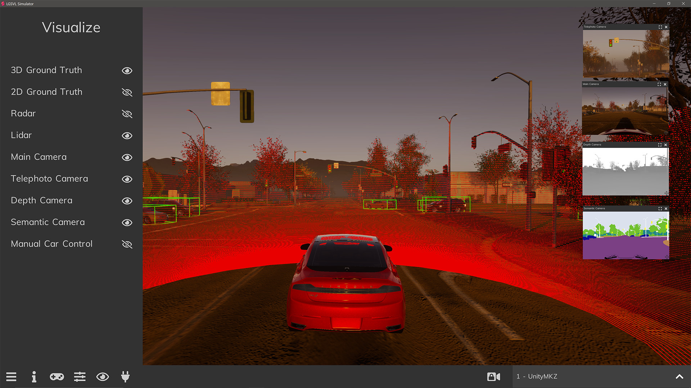
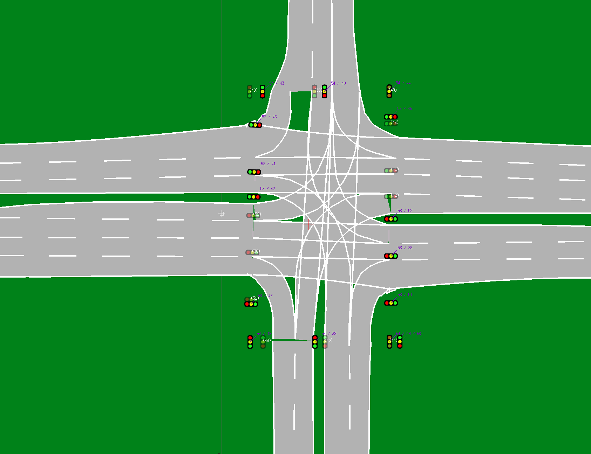

The 2019.09 release of SVL Simulator is now available for download on our [GitHub](https://github.com/lgsvl/simulator/releases/tag/2019.09). This release includes several updates.

### Sensor visualization user interface

The simulator binary includes a sensor visualization user interface. You can use this to toggle on/off camera views, LiDAR and RADAR visualizations, as well as ground truth bounding boxes. We are working on extending this visualization to other sensors as well, including GPS and IMU.

You can view the main camera, semantic segmentation camera, RADAR.

LiDAR can be visualized, as well as ground truth bounding boxes.

### Support for OpenDrive HD map format export

You can now export HD maps from the simulator in [OpenDrive](http://www.opendrive.org/) 1.4 format. After creating a new 3D environment and adding HD map annotations (or using a default environment), you can export to OpenDrive and import into your autonomous driving system for HD map information including lanes, junctions, traffic signals, and traffic signs.

### Traffic light control via Python API

You can now control traffic lights in environments using the Python API. You can read more about how to use this feature in the [documentation](https://www.svlsimulator.com/docs/python-api/#controllable-objects).

### Improved NPC waypoint system in Python API

NPC vehicles now have additional functionality for more robust waypoints. You can set NPC vehicles to wait a certain amount of time before proceeding to a waypoint. You can now also specify a trigger distance, enabling an NPC vehicle to pause until its distance to the ego vehicle reaches the trigger distance. You can read about their usage in the [documentation](https://www.svlsimulator.com/docs/python-api/#npc-vehicles).

### New vehicle: Hyundai Nexo 2018

We have added a new 3D vehicle model, the 2018 Hyundai Nexo provided by Hyundai Motors, on the [SVL Simulator Content](https://content.svlsimulator.com/vehicles/hyundai2018nexo/) site.

You can view the full release notes in our [documentation](https://www.svlsimulator.com/docs/changelog/).

Please don't hesitate to submit a [GitHub issue](https://github.com/lgsvl/simulator/issues) or email us directly at [contact@svlsimulator.com](mailto:contact@svlsimulator.com) with questions or feedback.
