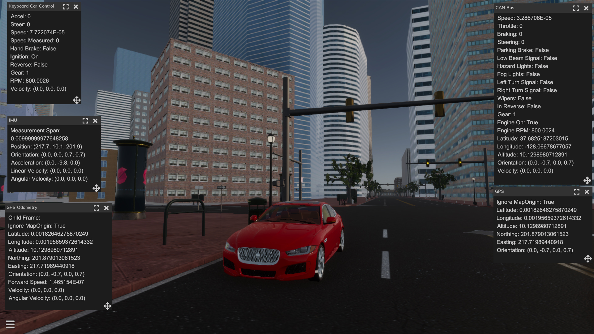

The SVL Simulator 2019.10 release is now [available](https://github.com/lgsvl/simulator/releases/tag/2019.10), and includes a new map, platform-independent asset bundles, and many more additions and improvements.

### New environment: Shalun Map

We have published a new map, Shalun, on our [content website](https://content.lgsvlsimulator.com/maps/). The Shalun map is a virtual environment of the Taiwan CAR Lab, a test facility for autonomous vehicles in Tainan, Taiwan. You can read more about the Taiwan CAR Lab [here](http://taiwancarlab.narlabs.org.tw/index_en.html). The map, provided with support from National Cheng Kung University, includes several intersections, horizontal traffic lights, and a roundabout.

The new Shalun map of the Taiwan CAR Lab in Tainan, Taiwan.

### Platform-independent asset bundles

We have now integrated platform-independent asset bundles for SVL Simulator content (3D environments and vehicles). Previously, users had to download different versions of the same map or vehicle depending on the platform they were running the simulator on (Windows or Linux). Now, you do not need to worry about needing to download a platform-specific asset bundle - one download supports both Windows and Linux versions of the simulator.

### Sensor data visualization for all sensors

You can now visualize non-image sensors while running a simulation in interactive mode. This includes GPS, IMU, and vehicle control values.

_Non-image sensor value visualizations in interactive mode._

### And many more improvements!

You can view the full release notes in our [documentation](https://www.lgsvlsimulator.com/docs/changelog/).

Please don't hesitate to submit a [GitHub issue](https://github.com/lgsvl/simulator/issues) or email us directly at [contact@lgsvlsimulator.com](mailto:contact@lgsvlsimulator.com) with questions or feedback.
