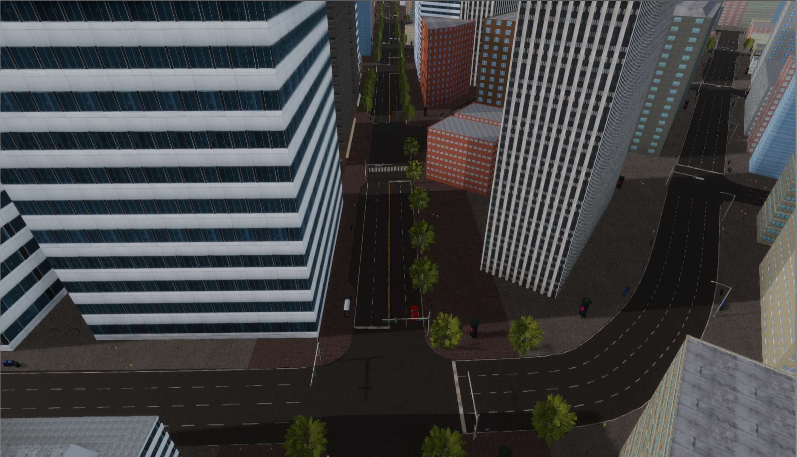

---
date: 2020-01-21
title: SVL Simulator 2019.12 Release
author: Shalin Mehta
preview: This release includes a new HDRP version map and custom API callbacks.
category: announcement
featuredImage: images/2020-01-21-2019-12-release-san-francisco.png
---

The 2019.12 release of SVL Simulator release is now [available](https://github.com/lgsvl/simulator/releases/tag/2019.12), and includes a new map, custom API callbacks, and many more additions and improvements.

### New Environment: San Francisco

We have converted the San Francisco map to HDRP, on our [content website](https://content.lgsvlsimulator.com/maps/sanfrancisco/). The San Francisco map is a re-creation of a section of SOMA San Francisco around Market Street. It features many traffic light intersections and multi-lane streets.

The HDRP version of the San Francisco map in California.

### Python Custom Callback

The Python API now supports a `custom` type callback. This is useful when creating custom sensors and need to send data to the Python API. See the example [Comfort Sensor script](https://github.com/lgsvl/ComfortSensor/blob/master/ComfortSensor.cs#L69) for how to add this callback to a custom sensor.

### Map Dependent NPCs

We've added properties to the `MapOrigin` component so that when creating a custom map, the type and quantity of NPCs can be controlled. For example, it does not make sense for School Busses to be in the AutonomouStuff parking lot so they will not be included in the list of potential NPCs.

## Features from SVL Simulator 2019.11 Release

### Important Note

Assetbundle versions changed with this release. Re-build or re-download existing bundles to use them with this release.

### New Environment: GoMentum Station

We have created a digital twin of GoMentum Station section Urban A, on our [content website](https://content.lgsvlsimulator.com/maps/gomentum/). GoMentum Station is a dedicated testing facility for connected and automated vehicle technology, owned and operated by AAA. It is located at the former Concord Naval Weapons Station in Concord, California.

The new GoMentum map of the GoMentum Station Urban A area in Concord, CA.

### Custom Sensors

It is now possible to write a custom sensor and attach it to a vehicle. These sensors can re-create other real-world sensors or record KPIs when running tests. See the [Comfort Sensor](https://github.com/lgsvl/ComfortSensor) for an example and the [docs](https://www.lgsvlsimulator.com/docs/sensor-plugins/) page for more information.

### And many more improvements!

You can view the full release notes in our [documentation](https://www.lgsvlsimulator.com/docs/changelog/).

Please don’t hesitate to submit a [GitHub issue](https://github.com/lgsvl/simulator/issues) or email us directly at [contact@lgsvlsimulator.com](mailto:contact@lgsvlsimulator.com) with questions or feedback.
