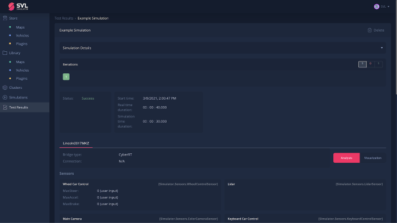

We are happy to announce the **2021.1** release of SVL Simulator (formerly [LGSVL Simulator](https://www.svlsimulator.com/news/2021-03-25-name-change)). This is a major update and refresh, introducing many new features as well as a new [web user interface](https://wise.svlsimulator.com). You can download the release [here](https://github.com/lgsvl/simulator/releases/tag/2021.1).

### New online web user interface

We have rolled out a new online web user interface for SVL Simulator. You can now upload and share your content, including environments, vehicles, and sensor plugins, with other registered users. As before, you can create and start simulations, then view the results of the test cases all within the browser in your account.

**Note**: You will need to create a new account to use SVL Simulator [here](https://wise.svlsimulator.com/), even if you have an account on the previous LGSVL Simulator system. Read more about the account migration process [here](https://www.svlsimulator.com/news/2021-03-25-account-migration).

<iframe style="display:block;margin:auto;" width="560" height="315" src="https://www.youtube.com/embed/Da-pj1mZRlI" frameborder="0" allow="accelerometer; autoplay; encrypted-media; gyroscope; picture-in-picture" allowfullscreen></iframe>

### Visual Scenario Creation Tool

We have added a GUI-based scenario creation tool called [Visual Scenario Editor (VSE)](https://www.svlsimulator.com/docs/creating-scenarios/visual-scenario-editor/). You can now create a scenario by placing ego vehicle(s), traffic agents, and objects, then setting behavior for agents and objects, which you can preview and save to run as a simulation.

<iframe style="display:block;margin:auto;" width="560" height="315" src="https://www.youtube.com/embed/9Fneu0PTEC4" frameborder="0" allow="accelerometer; autoplay; encrypted-media; gyroscope; picture-in-picture" allowfullscreen></iframe>

### Simulation test reports 

To help you analyze the results of simulated scenario test cases, we have added [detailed test reports](https://www.svlsimulator.com/docs/user-interface/web/test-results/) that show many types of detected events and sensor analytics.

Download the 2021.1 release on Github [here](https://github.com/lgsvl/simulator/releases/tag/2021.1). You can see our full release notes and guides in our [documentation](https://www.svlsimulator.com/docs).
