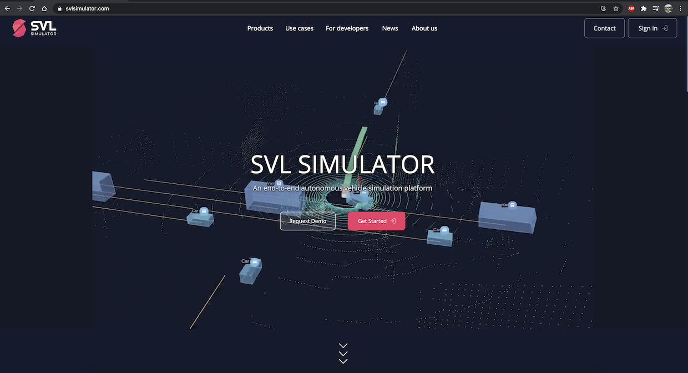
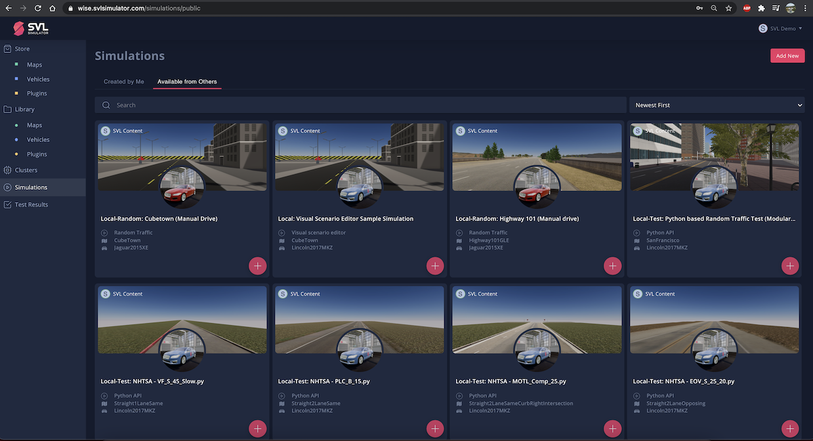

We are happy to announce that we are changing our name and branding from LGSVL Simulator to SVL Simulator. Coinciding with our latest [2021.1](https://github.com/lgsvl/simulator/releases/tag/2021.1) release, we have refreshed the product name to be more responsive and simple in order to communicate with our users around the world. SVL Simulator is developed by LG Electronics at the America R&D Lab in Santa Clara, California.

### What's new ?

#### New Product name and logo

#### New official website

Our new website is [www.svlsimulator.com](https://www.svlsimulator.com). The previous website, [www.lgsvlsimulator.com](https://www.lgsvlsimulator.com), will now redirect to this new website.

#### New online web user interface

The new web user interface for SVL Simulator 2021.1 is [wise.svlsimulator.com](https://wise.svlsimulator.com). See our [post](https://www.svlsimulator.com/news/2021-03-25-account-migration) for migrating your account and support for older releases.

If someone is asking what simulation tool you are using, let them know it is now SVL Simulator. We believe the new branding will be more intuitive and to the point. We will continue to innovate, support our open source community, and iterate based on feedback from our users. Please [get in touch](contact@svlsimulator.com) with us if you have questions or any feedback.
