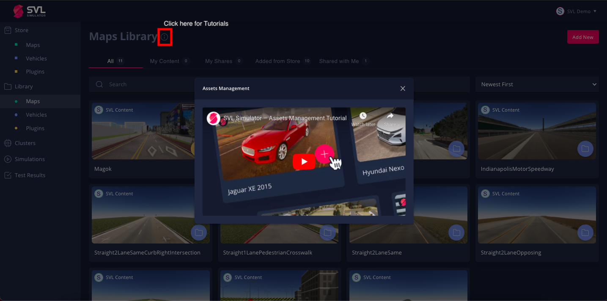

We are happy to announce the **2021.1.1** release of SVL Simulator. This is a minor update and refresh, introducing some new features as well as some bug fixes, mostly around the new [web user interface](https://wise.svlsimulator.com). You can download the release [here](https://github.com/lgsvl/simulator/releases/tag/2021.1.1).

### New interactive 3D visualizer for creating sensor configurations

With the 2021.1.1 release, the new interactive [3D sensor configuration visualizer](https://www.svlsimulator.com/docs/user-interface/web/library#interacting-with-the-visual-editor) helps you create or modify sensor configurations for your vehicles. The 3D visual editor is integrated with the parameter editor and allows you to visually place sensors around the vehicle.

<iframe style="display:block;margin:auto;" width="560" height="315" src="https://www.youtube.com/embed/a0-y968n59k" frameborder="0" allow="accelerometer; autoplay; encrypted-media; gyroscope; picture-in-picture" allowfullscreen></iframe>

### New HD Map Preview for uploaded assets

You can now preview an interactive [HD map](https://www.svlsimulator.com/docs/user-interface/web/library#previewing-the-hd-map) in your browser before choosing the map asset to use in the simulation. This will help you check if the road network on this 3D map is suitable for your desired simulation test case and scenario.

### Tutorials on all web-interface pages

We now have tutorial videos on all web user interface pages to better guide you on the workflow for a particular feature.

### Support for sharing private assets, simulations and test reports

You can now [share](https://www.svlsimulator.com/docs/simulation-content/sharing) your private maps, vehicles, plugins, simulations and test reports with other registered users through the web user interface. This enables you to share uploaded content and simulations with team members or other collaborators, as well as quickly reproduce and verify others' results.

<iframe style="display:block;margin:auto;" width="560" height="315" src="https://www.youtube.com/embed/KL-PxiHpPH0?start=101" frameborder="0" allow="accelerometer; autoplay; encrypted-media; gyroscope; picture-in-picture" allowfullscreen></iframe>

Download the 2021.1.1 release on Github [here](https://github.com/lgsvl/simulator/releases/2021.1.1). You can see our full release notes and guides in our [documentation](https://www.svlsimulator.com/docs).
