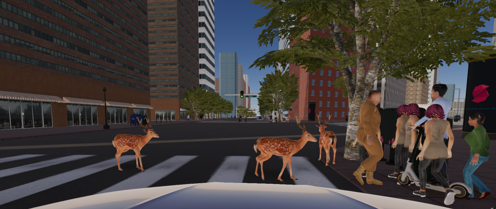
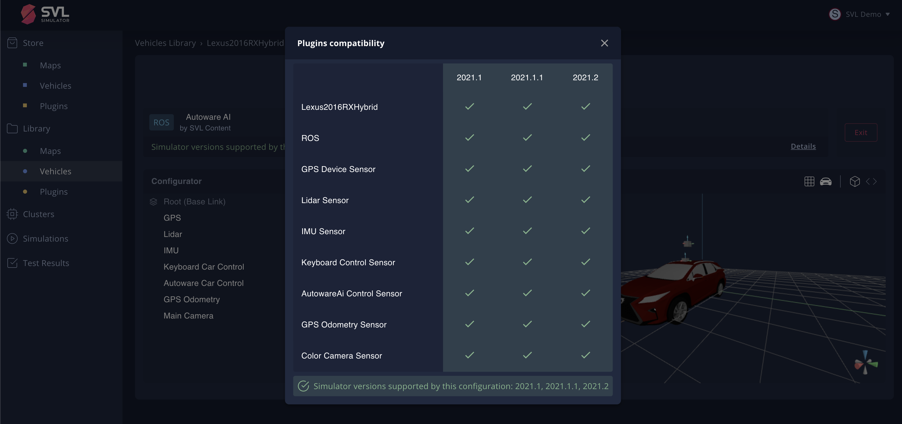
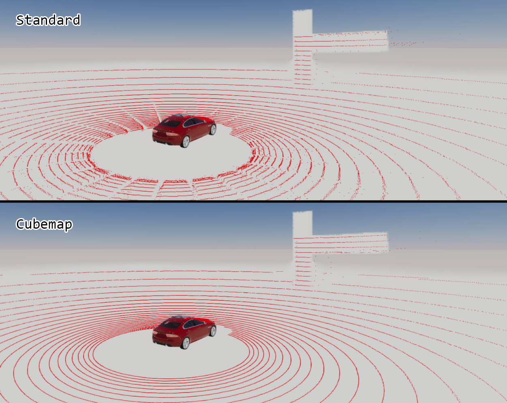

We are happy to announce the **2021.2** release of SVL Simulator. This is a major update and refresh, introducing some new features as well as some bug fixes. You can download the release [here](https://github.com/lgsvl/simulator/releases/tag/2021.2).

### Support for external Pedestrians and NPCs

[Pedestrians](https://www.svlsimulator.com/docs/plugins/pedestrian-plugins) and [NPCs](https://www.svlsimulator.com/docs/plugins/npc-plugins) are separated from the simulator and can be loaded from asset bundles. You will still need to build NPCs and Pedestrians as external assets with Simulator, as they are not yet supported from the web user interface. We have also added new NPC and Pedestrian types like Scooters, Bicyclists and Animals. These are currently available through our binary builds only.

### Support for external Bridges

[Bridges](https://www.svlsimulator.com/docs/plugins/bridge-plugins),for interfacing between the simulator and your System Under Test, are also separated from the simulator and can be loaded as asset bundles from the web user interface. You can now build your own bridge for SVL Simulator and upload it to your library to include in a simulation. The following bridges are supported as default: ROS, ROS2, and CyberRT. We also have open sourced an [example](https://github.com/lgsvl/LoggingBridge) of a custom bridge implementation.

### Support for multiple versions of asset bundles on web user interface

SVL Simulator's cloud based [web user interface](https://wise.svlsimulator.com) can now manage and serve content for different versions of SVL Simulator. You can now edit asset bundles for different simulator versions to already added assets on the web user interface instead of creating duplicate assets per version. The web user interface can confirm validity of asset versions against the simulator version under test before it is run, to avoid simulation failures due to mismatched asset versions.

### Improved distributed simulation with multi-ego support

We have made several bug fixes, stability and performance improvements to support running multiple ego vehicles in a [distributed simulation](https://www.svlsimulator.com/docs/distributed-simulation/distributed-simulation-introduction/) environment.

### Multiple improvements in the Interactive 3D sensor configuration editor

With the 2021.2 release, we have improved the user experience for the [3D sensor configuration editor](https://www.svlsimulator.com/docs/user-interface/web/library#interacting-with-the-visual-editor) that helps you create or modify sensor configurations for vehicles. Improvements include: better zoom and centering of the vehicle, opacity and grid toggles, axes color updates, mouse based controls, and bug fixes on parent-child sensor transform.

### Performance improvements to LiDAR Sensor

The default SVL Simulator LiDAR implementation now uses a cubemap texture instead of a pool of tall, 2D textures. This change fixes artifacts due to tall textures and solid point cloud rendering. This change improves LiDAR scaling--high beam counts, scans per rotation and frequency--and should yield higher performance during simulation.

### Support for simulations without EGO vehicle (Spectator EGO)

[Spectator Ego](https://wise.svlsimulator.com/vehicles/profile/67b5d63f-d343-4b8d-9a24-37c6cb3358cd) is an empty Ego vehicle without colliders, geometry, and vehicle dynamics. Use this vehicle when there is no need for Ego to be present during simulation. You can still attach sensors or observe simulation.

Download the 2021.2 release on Github [here](https://github.com/lgsvl/simulator/releases/2021.2). You can see our full release notes and guides in our [documentation](https://www.svlsimulator.com/docs).
