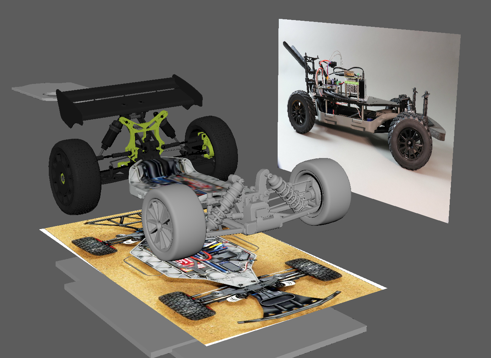

Have you met F1Tenth yet? It’s a test vehicle SVL Simulator created for the [F1Tenth autonomous racing challenge](https://f1tenth.org/).

Here is F1Tenth at the starting line!

And here is a behind the scenes peak at how we built F1Tenth.

You can try F1Tenth for yourself [here](https://wise.svlsimulator.com/vehicles/profile/3bb4c2eb-82d3-4ee3-8ebb-2bdbcf6e88ea). Be sure to also check out our IMS F1Tenth map. It is a 1/10th scale version of the Indianapolis motor Speedway and available [here](https://wise.svlsimulator.com/maps/profile/efc093ec-f092-4e9e-8e4d-0df84800a011).

<iframe style="display:block;margin:auto;" width="560" height="315" src=""https://www.youtube.com/embed/rdFcs5qDswk frameborder="0" allow="accelerometer; autoplay; encrypted-media; gyroscope; picture-in-picture" allowfullscreen></iframe>

