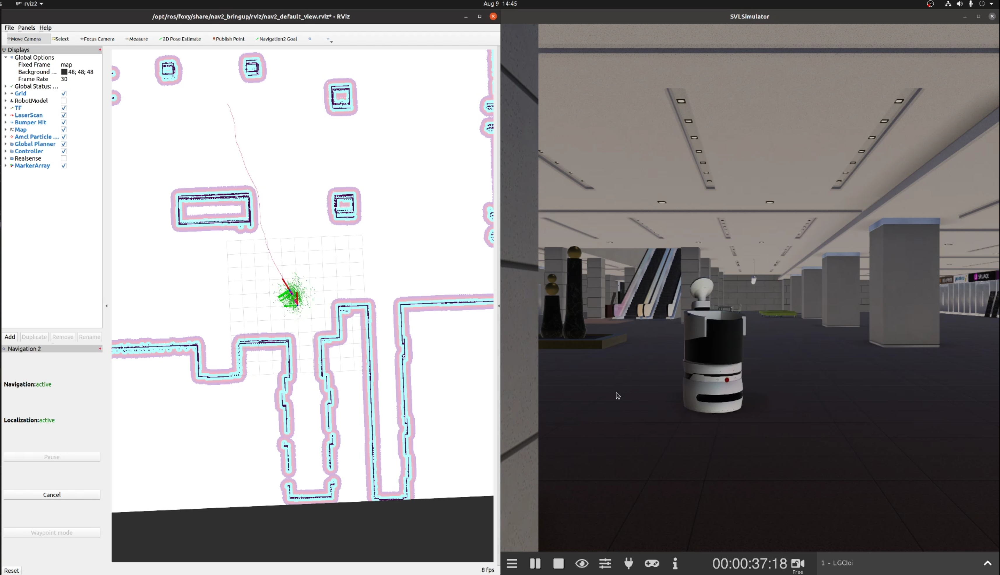

We are happy to announce the 2021.2.2 release of SVL Simulator. 

This release adds support for indoor robot simulation. Building on top of our default support for ROS 1 and ROS 2, SVL Simulator now enables you to add autonomous mobile robots for indoor environments. You can find the release [here](https://github.com/lgsvl/simulator/releases/tag/2021.2.2).

Previously, SVL Simulator supported autonomous vehicle and simulation use cases with automotive vehicle models and outdoor, HD map-based environments. Now, with a sample indoor environment and support for Unity's ArticulationBody, you can run simulations for your indoor robot scenarios. The first indoor environment we are releasing, [LGSeocho](https://wise.svlsimulator.com/maps/profile/26546191-86e8-4b53-9432-1cecbbd95c87), does not have an HD map, and instead enables robots to drive around anywhere on the map floor.

We have also released our first sample Robot, [LGCloi](https://wise.svlsimulator.com/vehicles/profile/20609b67-6dbd-40ad-9b46-e6bc455278ed). You can use this to try some of our tutorials and refer to a sample [Navigation2 sensor configuration](https://wise.svlsimulator.com/vehicles/profile/20609b67-6dbd-40ad-9b46-e6bc455278ed/edit/configuration/c2207cd4-c8d0-4a12-b5b7-c79ab748becc).

With support for ArticulationBody-based ego vehicles and robots, you can create more sophisticated ego models that involve more complex physics linkages or dynamics that do not follow the traditional dynamics behaviors of cars. Also, with our example [Differential Drive Control sensor](https://www.svlsimulator.com/docs/simulation-content/differential-drive-control), you can see how to modify or create sensor plugins that work directly with your own robot model, by specifying the topics published and subscribed to in order to control your robot(s).

With SVL Simulator indoor robot support, you will be able to more easily run single and multi-robot simulations in a real time 3D environment to test algorithms for indoor autonomous mobile robot applications that include hospitality, warehouse, and factory robots.

We have created two new tutorials to help you get started with indoor robotics simulation. 

The [first one](https://www.svlsimulator.com/docs/tutorials/robotics-pub-sub) walks you through creating a basic simulation where you can directly publish simple control commands with ROS 2. The [second tutorial](https://www.svlsimulator.com/docs/tutorials/robotics-ros2) builds on this by connecting your robot to the Nav2 navigation stack, enabling you to start modifying and testing your autonomous robot's algorithms for e.g. planning and control.

Look out for our upcoming tutorials on running multi-robot simulations with Nav2!

Download the 2021.2.2 release on Github [here](https://github.com/lgsvl/simulator/releases/tag/2021.2.2). You can see our full release notes and guides in our [documentation](https://www.svlsimulator.com/docs).
